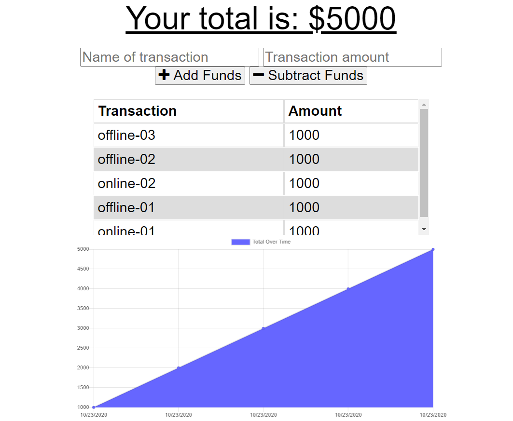
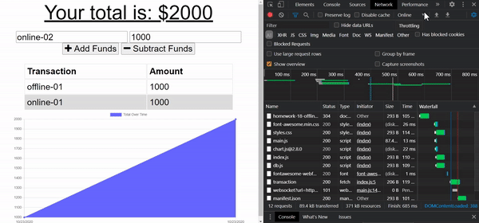
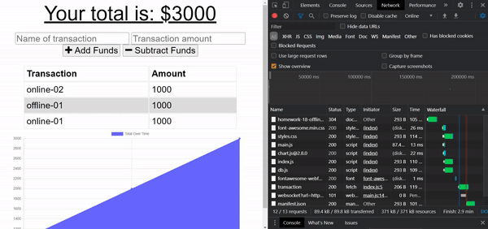

# Unit 18 PWA Homework: Online/Offline Budget Trackers
* Use MongoDB as the database to connected to the Heroku

[](https://opensource.org/licenses/MIT)



### Project Description

* A sample full-stack application that user can manage their budget
* The user can deposits and expenses even if the browser is offline
* The application is deploy on Heroku

### Usage
#### Online deposits



#### Offline deposits
-  The browser save the user deposits into the indexedDB and push the data back to the database when the browser reconnected




### Language
```md
Javascrpit
Node.js
Express
MongoDB
HTML
CSS
```

## About
* Heroku link: https://homework-18-offline-budget.herokuapp.com/
* Project Github: https://github.com/DanielYu0864/DanielYu-HomeWork-18-Progressive-Budget
* Author: [`DanielYu0864`](https://github.com/DanielYu0864)

## Questions
*  For more question please contact me: adam741963@gmail.com


- - -
© 2020 - UW Coding Bootcamp Homework 18 Online/Offline Budget Trackers by Daniel Yu
